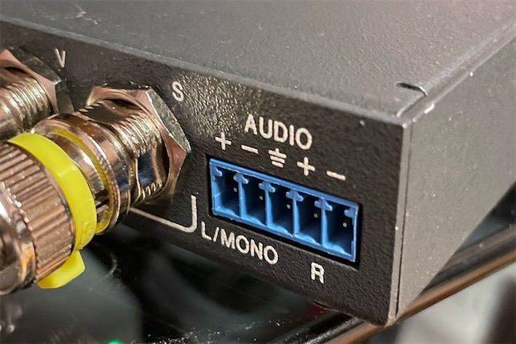

# Extron Audio 3.5mm Adapter

This is an 3.5mm audio input/output adapter for the Extron switches. It conforms to the circuit design of the official CSM6 adapter to enable correct audio levels when balanced audio is adapted to unbalanced audio through a 3.5mm jack.

-----------
## Parts

- [PCB](https://oshpark.com/shared_projects/oJI7PVwu)

- Terminal Plug - 5 pin, 3.5mm pitch, right angle, through-hole - [Link](https://github.com/jeffqchen/JeffParts/blob/main/Connectors/Phoenix%20Terminal%20Connector/Female%20PCB/info.md)

- Horizontal 3.5mm Headphone Jack - [Link](https://github.com/jeffqchen/JeffParts/blob/main/Connectors/3.5mm%20Audio%20Jack/Horizontal%203-Pin%20PCB/info.md)

- M2x12mm screw and hex nut - [Link](https://github.com/jeffqchen/JeffParts/blob/main/Parts/M2%20M3%20Hex%20Screw%20%26%20Nut/info.md)

- 2x Resistors 1K Ohm - SMD 0805/0603 OR through-hole 1/4W

- 3D Printed Shell

-----------
## 3D Printing The Shell

Print "Shell.stl" and "Stopper.stl".*

Print the shell sideways, without support.

Print the stopper standing, with the screw hole vertical.

** * Note: ** for Extron devices with a connector that's flush with the shell (such as the RGB series), please use the shell called "Shell Flush.stl". The normal one does not seat properly and the connection will be loose.

-----------
## Assembly

Solder all the components onto the PCB. Trim the extruding leads on the bottom as much as possible, but perfection is not required.

Slide the PCB assembly into the 3D printed shell from the rear opening. Push it all the way in. Then slide the printed stopper piece into the center cavity. Then secure the entire assembly with the M2 screw and nut. DO NOT over-tighten the screw, or the shell might crack.

If you plan to use the adapters side-by-side on a CrossPoint switch, take a side cutter and cut off the two side walls of the terminal plug. This will ensure two adjacent plugs won't interfere with each other.

--------
Special Thanks

qwertymodo (for the schematics of the original adapter)
- https://qwertymodo.com/
- https://twitter.com/qwertymodo

--------
Shield: [![CC BY-SA 4.0][cc-by-sa-shield]][cc-by-sa]

This work is licensed under a
[Creative Commons Attribution-ShareAlike 4.0 International License][cc-by-sa].

[![CC BY-SA 4.0][cc-by-sa-image]][cc-by-sa]

[cc-by-sa]: http://creativecommons.org/licenses/by-sa/4.0/
[cc-by-sa-image]: https://licensebuttons.net/l/by-sa/4.0/88x31.png
[cc-by-sa-shield]: https://img.shields.io/badge/License-CC%20BY--SA%204.0-lightgrey.svg
